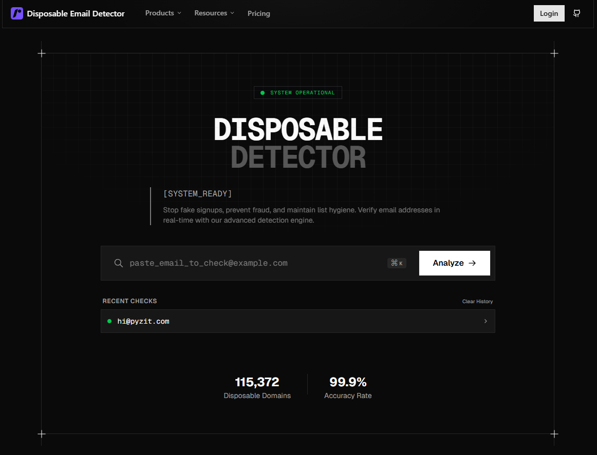

# Temp Mail Detector

**Temp Mail Detector** is a free online tool that helps identify temporary, disposable, and fake email addresses in real time.

🔗 Website: https://temp-mail-detector.pyzit.com/

---

## 🔍 What is Temp Mail Detector?

Temp Mail Detector allows developers, businesses, and website owners to quickly check whether an email address belongs to a **temporary or disposable email service**. This helps prevent:

- Fake signups
- Spam accounts
- Abuse of free trials
- Invalid user registrations

---

## 🚀 Features

- Detects temporary & disposable email domains
- Fast and lightweight
- No signup required
- Works directly in the browser
- Useful for validation systems and security checks

---

## 🌐 Live Demo

You can use the tool directly here:  
👉 https://temp-mail-detector.pyzit.com/

---

## 📌 Use Cases

- User registration validation
- Email verification systems
- Anti-spam protection
- SaaS and API security
- Form submission filtering

---

## 📄 About This Repository

This repository is **informational only** and does not contain the source code of the application.  
It exists to provide documentation, references, and links to the live service.

---

## 🔗 Official Website

https://temp-mail-detector.pyzit.com/

---

## 📫 Contact / Support

For updates or inquiries, please visit the official website.

---

## ⭐ Keywords

temp mail detector, disposable email detector, temporary email checker, fake email detection, email validation tool
